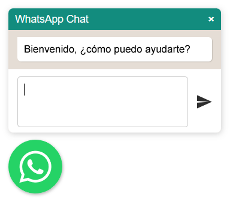
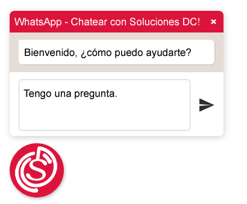

# WhatsApp Emergente

Este es un complemento de botón emergente de WhatsApp muy simple para jQuery.

Puedes agregar un botón emergente a tu sitio que llama a la [API de WhatsApp Click para Chetear](https://faq.whatsapp.com/en/26000030/).

Comenzaras automáticamente un chat de WhatsApp con el número establecido cuando el usuario haga clic en el botón.

También puedes activar una ventana de chat falsa con un mensaje personalizado donde el usuario puede ingresar su respuesta antes de abrir WhatsApp.

## Instalación

Vincula los archivos a tu html (asegurate de cargar los archivos después de jQuery)

```html
<script type="text/javascript" src="jquery-3.3.1.min.js"></script>
<script type="text/javascript" src="floating-wpp.min.js"></script>
<link rel="stylesheet" href="floating-wpp.min.css">
```

## Cómo usarlo

Crea un elemento div y seleccionalo con jQuery, luego llama al complemento usando la función `$().floatingWhatsApp([options])`.

```html
<body>
  <div id="MiBotonWhatsApp"></div>
</body>
<script type="text/javascript">
  $(function () {
    $('#MiBotonWhatsApp').floatingWhatsApp({
      phone: '525541696993'
    });
  });
</script>
```
### Ventana de Chat Falsa

Habilita una pequeña ventana de chat falsa que flota sobre el botón:

```js
$('#MiBotonWhatsApp').floatingWhatsApp({
    phone: '525541696993',
    popupMessage: 'Bienvenido, ¿cómo puedo ayudarte?',
    showPopup: true
});
```



### Personalización

Puedes personalizar la apariencia del botón y la ventana de chat:

```js
$('#MiBotonWhatsApp').floatingWhatsApp({
    phone: '525541696993',
    popupMessage: 'Bienvenido, ¿cómo puedo ayudarte?',
    message: "Tengo una pregunta.",
    showPopup: true,
    showOnIE: false,
    headerTitle: 'WhatsApp - Chatear con Soluciones DC!',
    headerColor: 'crimson',
    backgroundColor: 'crimson',
    buttonImage: ''
});
```



### Opciones

| opción              | valor                                         | default                  | descripción |
|---------------------|-----------------------------------------------|--------------------------|-------------|
| phone               | `string`                                      | `''`                     | [Número internacional WhatsApp](https://faq.whatsapp.com/en/general/21016748) que recibirá el mensaje.
| message             | `string`                                      | `''`                     | Mensaje a enviar. Sí `showPopup` es `true`, la entrada se completará con este mensaje.
| position            | `'left'` &#124; `'right'`                     | `'left'`                 | Posición inferior del botón en la pantalla.
| popupMessage        | `string`                                      | `''`                     | Mensaje que se mostrará como mensaje recibido en el chat falso.
| showPopup           | `bool`                                        | `false`                  | Muestre una ventana emergente de chat falso cuando el usuario se desplaza (en el escritorio) o hace clic en el botón (en el dispositivo móvil).
| autoOpenTimeout     | `Number`                                      | `0`                      | Establezca una cantidad de tiempo en milisegundos para que la ventana emergente se abra automáticamente.
| headerColor         | Cualquier color css `string`                        | `'#128C7E'`              | Color de fondo de la barra de título de la ventana emergente.
| headerTitle         | `string`                                      | `'WhatsApp Chat'`        | Texto que se mostrará en la barra de título de la ventana emergente.
| buttonImage         | `jQuery` objeto &#124; selector css `string`  | [this one](whatsapp.svg) | Imagen de fondo del botón. debe ser un `img` o un `svg` para que se muestre correctamente.
| zIndex              | `Number` &#124; `string`                      | none                     | Anulaciones `.floating-wpp` div índice z. Usa un valor de propiedad css de índice z.
| showOnIE            | `boolean`                                     | `true`                   | Muestra o no el botón en IE (recomendado, ya que IE no es compatible con WhatsApp Web).
| size                | `string` (Cualquier opción css válida para las propiedades de ancho y alto) | `'72px'` | El tamaño del botón.
| backgroundColor     | cualquier color css `string`                        | `'#25D366'`               | El color de fondo del botón.
